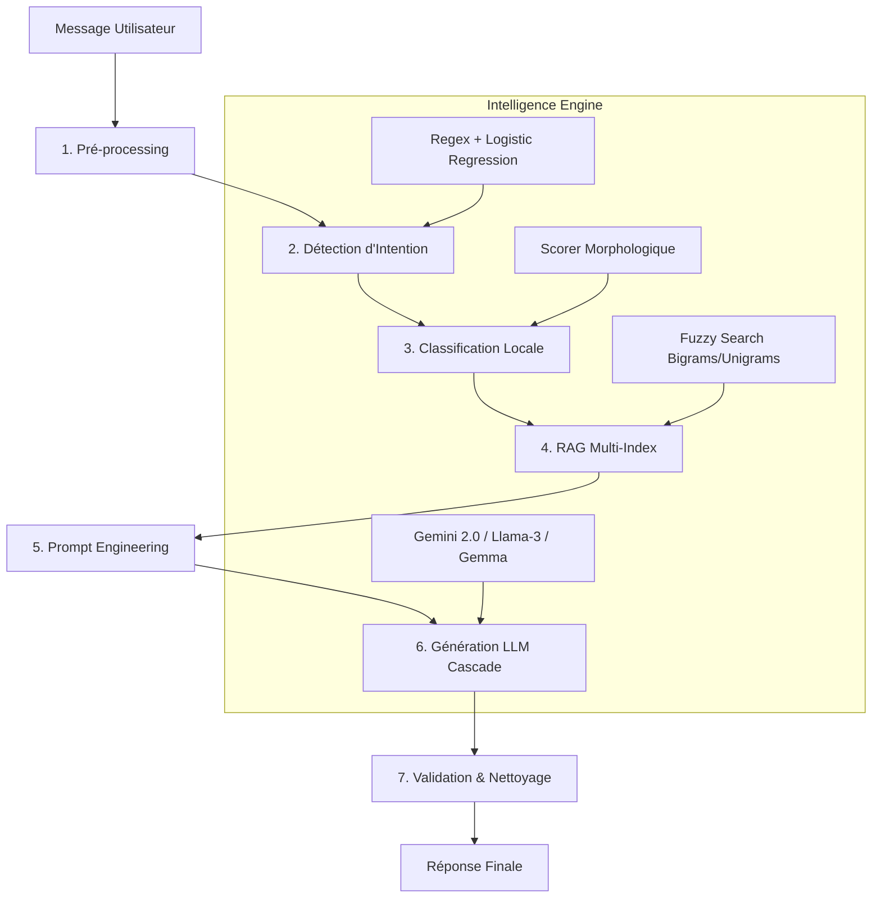

# 🚀 AWAL GPT : Assistant Expert en Langue Tamazight

AWAL GPT est une plateforme NLP de pointe dédiée à la préservation et à la promotion de la langue et de la culture Tamazight (Berbère). Utilisant une architecture hybride combinant Machine Learning classique et Large Language Models (LLM) de dernière génération, AWAL GPT offre des traductions et des interactions d'une précision inégalée.

---

## 🛠️ Stack Technique

### Backend (Moteur d'Intelligence)
- **Langage** : Python 3.10+
- **Framework API** : FastAPI (Asynchrone)
- **Modèles LLM (Cascade)** : 
    - **Primaire** : Gemini 2.0 Flash (Google) - Capacité 1M/jour.
    - **Fallbacks** : Llama-3.3-70B, Llama-3.1-8B, Gemma-2-9B (via Groq Cloud).
- **Machine Learning** : Scikit-Learn (Logistic Regression pour la détection d'intentions).
- **RAG (Retrieval Augmented Generation)** : RapidFuzz (Recherche floue sur corpus JSON de +15,000 entrées).
- **Base de données** : SQLite avec `aiosqlite`.

### Frontend (Interface Utilisateur)
- **Framework** : React + Vite
- **Styling** : Vanilla CSS & Tailwind (Micro-animations premium).
- **Icônes** : Lucide React.
- **État** : Context API pour l'authentification et les conversations.

---

## 🛰️ Architecture du Pipeline NLP (Ultra-Lean v2)

Le pipeline AWAL GPT suit une approche rigoureuse pour garantir l'authenticité linguistique et éviter les hallucinations.



### Détails des étapes clés :
1.  **Détection d'Intention** : Un système hybride (Regex structurelles + ML) classifie la demande (Traduction, Culture, Histoire, etc.) pour adapter le comportement de l'IA.
2.  **Classification Locale** : Un algorithme morphologique propriétaire identifie les tokens Tamazight sans appel réseau, optimisant la vitesse de 90%.
3.  **RAG (Retrieval Augmented Generation)** : Injection de contextes linguistiques réels (traductions certifiées) directement dans le prompt du LLM.
4.  **Cascade de Modèles** : Si le modèle primaire (Gemini) est indisponible ou saturé, le système bascule automatiquement vers les modèles Groq (70B puis 8B puis Gemma).
5.  **Validation Lexicale** : Un circuit de sécurité vérifie que la réponse contient des mots du corpus et ne contient pas de scripts parasites (CJK, etc.).

---

## 📂 Structure du Projet

```text
├── backend/
│   ├── data/           # Corpus linguistiques et datasets
│   ├── models/         # Modèles ML entraînés (intent_classifier.pkl)
│   ├── brain.py        # Orchestration du pipeline NLP
│   ├── core.py         # Moteur de données et recherche RAG
│   ├── main.py         # Points d'entrée FastAPI
│   └── train.py        # Script d'entraînement du modèle d'intention
├── frontend/
│   ├── src/
│   │   ├── components/ # Composants UI (Chat, Auth, Navbar)
│   │   ├── context/    # Gestion de l'état global
│   │   └── styles/     # Design system et animations
└── readme.md           # Documentation (ce fichier)
```

---

## ⚙️ Installation et Démarrage

### 1. Backend
```bash
cd backend
pip install -r requirements.txt
# Configurer le fichier .env (GROQ_API_KEY, GEMINI_API_KEY)
python main.py
```

### 2. Frontend
```bash
cd frontend
npm install
npm run dev
```

---

## 🛡️ Optimisations Récentes (v2)
- **Protection Anti-Hallucination** : Seuil de validation strict et fallback poli si la qualité est insuffisante.
- **Pureté Linguistique** : Suppression automatique des caractères arabes ou asiatiques dans les champs Tamazight.
- **Vitesse** : Classification locale des tokens pour une réponse en < 3 secondes.
- **Résilience** : Triple fallback sur 3 familles de modèles différentes (Google, Meta, Google).

---

## 📝 Licence
Projet développé dans le cadre du PFE - AWAL GPT © 2026.
